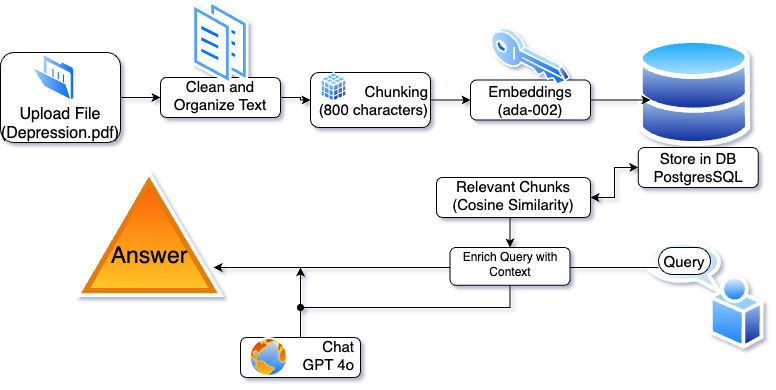

# 📘 RAG Depression Guide

## A Retrieval-Augmented Generation (RAG) System for Answering Questions on Depression

This project develops a **RAG system** to improve responses to user queries by retrieving relevant document chunks stored in a postgres database before passing them to **GPT-4o model** for answers with relevant context. The system evaluates **RAG vs. non-RAG** responses based on **relevance, completeness, and conciseness** using an GPT-4o evaluation.

---

## Project Overview

1️. **User submits a query** via a **Streamlit UI**  
2️. **Top document chunks** are retrieved based on **similarity scores**  
3️. **Responses are generated** using both **GPT-4o without RAG** and **GPT-4o with RAG**  
4️. **Both outputs are evaluated** using an **LLM-based grading system**  
5️. **Results are visualized** in **tables** and **graphs**  

---

## Project Structure


| File               | Description |
|--------------------|-------------|
| `main.py`       | Streamlit UI for query input, response generation, and evaluation display. |
| `eval.py`       | Implements response evaluation, computes Jaccard similarity and compares RAG vs. non-RAG answers. |
| `evaltest.py`   | Standalone script to test and display RAG evaluation results. |
| `embeddings.py` | Generates embeddings for each chunk using OpenAI's embedding API. |
| `search.py`     | Retrieves top document chunks based on cosine similarity. |
| `extractor.py`  | Extracts relevant text from documents to cleaned and chunked. |
| `processing.py` | Processes text by cleaning and chunking. |
| `storing.py`    | Stores vectorized document representations in a database. |
| `visualize.py`  | Visualization for cosine similarity histogram. |
| `maintests.py`  | Runs tests to validate individual functions and system components. |
---

## Setup & Installation

### 1️. Install Dependencies

**Python 3.10+** and the required libraries:
```
pip install -r requirements.txt
```

### 2. Set up Supabase Database
- Create Free Account
- Create New Project


Set up table
```
CREATE TABLE embeddings (
    chunk_id TEXT PRIMARY KEY,
    heading TEXT,
    content TEXT,
    vector VECTOR(1536)
);
```

### 3. Set up .env file with postgres key and openai apikey
Use connection string from supabase in python (session pooler)
```
openai_key = xxxx
postgres_url = xxx
```

### 4. Run the Streamlit App
Start the streamlit app by running:
```
streamlit run main.py
```

### 5. Run the pipeline for testing and populating db
```
python main.py
```
---

## System Pipeline and Architechture
pdf-file: https://www.camh.ca/-/media/health-info-files/guides-and-publications/depression-guide-en.pdf

### Steps:

1. Extracting & Preprocessing PDF
Load the PDF, extract text, cleans up noise, and standardize. 

2. Chunking and Organizing
Identify headings from TOC and divide text, chunk size 800 and overlap 100.

3. Embedding the Text 
Pass chunks through OpenAi's ada-002 model to get embeddings.

4. Store and Search
Store embeding vectors in PostgresSQL.
Retrieve top-k chunks based on cosine similarity.

5. Generate Responses
Send user query to gpt-4o and compare rsponses with RAG injection, and baseline.

6. Evaluate
Evaluate using jaccard, response length, gpt-4o evaluations on 1-10 scale.



---

## Frontend

### Query Processing
1. User enters a **query** in the **Streamlit interface**.
2. The system **retrieves top 5 relevant document chunks** using **cosine similarity**.
3. Two responses are generated:  
   - **Baseline GPT-4o** 
   - **RAG-Enhanced GPT-4o** 

### Evaluations
Responses are compared 
- **Automated LLM-based evaluation**, scoring:
    - **Relevance** → Does the response answer the question?  
    - **Completeness** → Does it provide enough useful details?  
    - **Conciseness** → Is it direct and to the point?  

- **Jaccard similarity** (alignment with retrieved text)
- **Response length** (character count for verbosity)


### Visualization
Results are displayed in **tables and bar charts**, comparing:

- **Response Quality** (*RAG vs. No-RAG*)  
    - **Relevance, Completeness, Conciseness Scores**  
    - **Average Score Overlay**  
- **Cosine Similarity Histogram** (*for Retrieved Chunks*)  


